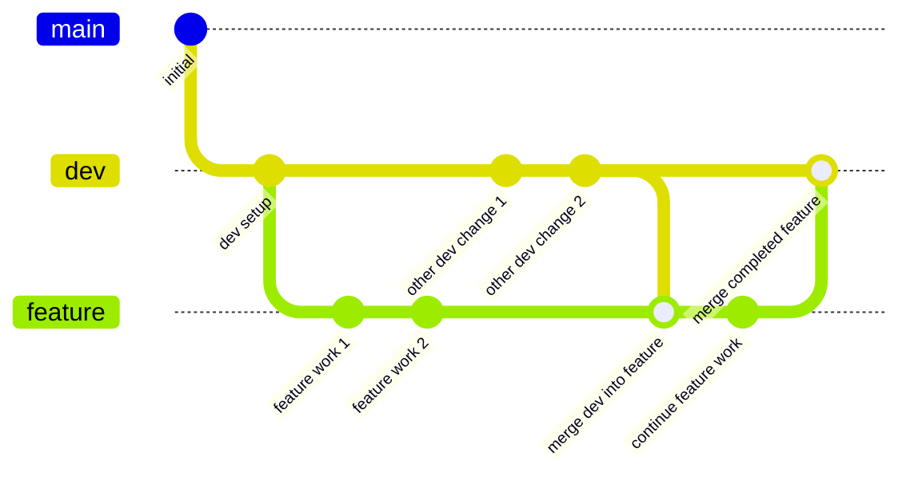

# Git Merge Workflow Example

This example demonstrates how to handle changes in the Dev branch while working on a feature branch using the **merge approach**.

## The Scenario

1. You start a feature branch from Dev
2. While you're working, other developers merge their features into Dev
3. You need to incorporate these Dev changes into your feature branch before completion

## Diagram



## Step by Step Instructions

### 1. Setup

```bash
# Assume you already have a repo with master and dev branches

# Make sure you're on the dev branch
git checkout dev

# Pull the latest changes from dev
git pull origin dev
```

### 2. Create Feature Branch

```bash
# Create and switch to a new feature branch
git checkout -b feature/user-authentication

# Make initial changes
echo "function authenticate() { /* initial version */ }" > auth.js
git add auth.js
git commit -m "feat: Add authentication function"

# Make more changes
echo "function validateCredentials() { /* ... */ }" >> auth.js
git add auth.js
git commit -m "feat: Add credential validation"
```

### 3. Dev Branch Changes While You Work

Meanwhile, other developers make changes to the dev branch. Here's how that might look:

```bash
# Another developer merges their feature to dev
# These commands would be run by someone else
git checkout dev
git merge feature/some-other-feature
git push origin dev

# Another change to dev
git commit -am "feat: Add notification system"
git push origin dev
```

### 4. Incorporate Dev Changes Using Merge

Now you need to bring those dev changes into your feature branch:

```bash
# Make sure your dev branch is up to date
git checkout dev
git pull origin dev

# Go back to your feature branch
git checkout feature/user-authentication

# Merge dev into your feature branch
git merge dev
```

### 5. Resolve Any Conflicts

If there are conflicts:

```bash
# Edit the conflicting files to resolve conflicts
# Then:
git add <conflicted-files>
git commit -m "merge: Resolve conflicts from dev integration"
```

### 6. Continue Working on Your Feature

```bash
# Continue with your feature work
echo "function getUserRoles() { /* ... */ }" >> auth.js
git add auth.js
git commit -m "feat: Add user role retrieval"
```

### 7. Complete and Merge Your Feature

```bash
# Final changes
echo "function finalizeAuth() { /* ... */ }" >> auth.js
git add auth.js
git commit -m "feat: Finalize authentication system"

# Merge your feature into dev
git checkout dev
git merge feature/user-authentication
git push origin dev
```

## Advantages of the Merge Approach

1. **Preserves History**: The full history of your feature branch development is preserved, including when and how you integrated Dev changes
2. **Non-Destructive**: Doesn't change existing commits - just adds a merge commit
3. **Simple Process**: Easy to understand and execute, especially for Git beginners
4. **Safe for Shared Branches**: Won't cause issues if your feature branch is already pushed and shared with others

## Disadvantages of the Merge Approach

1. **Creates "Merge Bubbles"**: Can create a more complex branching structure in the history
2. **More Merge Commits**: Your history will have extra merge commits 
3. **Less Linear History**: The overall project history may be harder to follow

## When to Use Merge

Consider using merge when:
- Your feature branch is already pushed and shared with others
- You want to preserve the exact history of your development process
- You're working with developers who are less familiar with Git
- You're concerned about the complexity of handling conflicts during rebase

See the [Rebase Workflow](../rebase-workflow) for an alternative approach. 