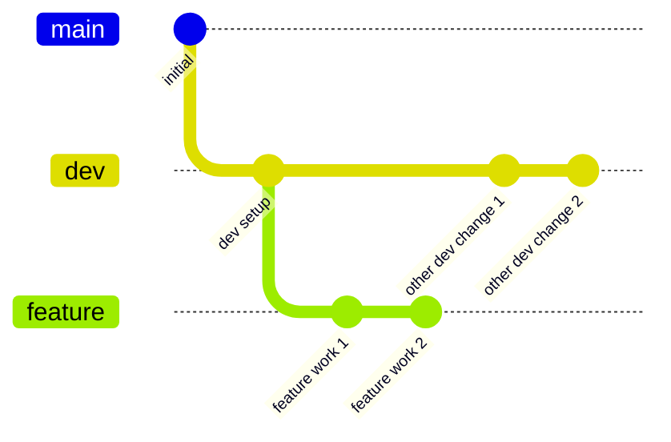
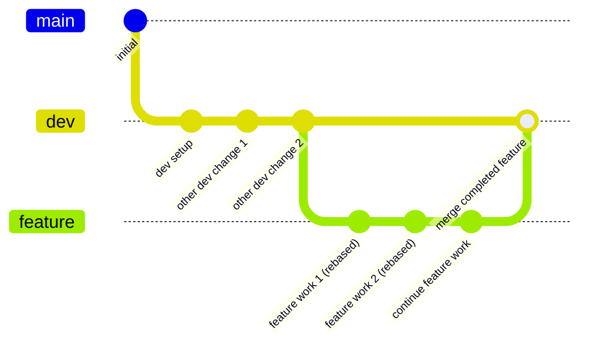

# Git Rebase Workflow Example

This example demonstrates how to handle changes in the Dev branch while working on a feature branch using the **rebase approach**.

## The Scenario

1. You start a feature branch from Dev
2. While you're working, other developers merge their features into Dev
3. You need to incorporate these Dev changes into your feature branch before completion
4. You want to maintain a clean, linear history

## Diagram

Before rebase:


After rebase:


## Step by Step Instructions

### 1. Setup

```bash
# Assume you already have a repo with master and dev branches

# Make sure you're on the dev branch
git checkout dev

# Pull the latest changes from dev
git pull origin dev
```

### 2. Create Feature Branch

```bash
# Create and switch to a new feature branch
git checkout -b feature/data-visualization

# Make initial changes
echo "function renderChart() { /* initial version */ }" > chart.js
git add chart.js
git commit -m "feat: Add chart rendering function"

# Make more changes
echo "function processData() { /* ... */ }" >> chart.js
git add chart.js
git commit -m "feat: Add data processing function"
```

### 3. Dev Branch Changes While You Work

Meanwhile, other developers make changes to the dev branch:

```bash
# Another developer merges their feature to dev
# These commands would be run by someone else
git checkout dev
git merge feature/some-other-feature
git push origin dev

# Another change to dev
git commit -am "feat: Add logging system"
git push origin dev
```

### 4. Incorporate Dev Changes Using Rebase

Now you need to bring those dev changes into your feature branch, but with rebase:

```bash
# Make sure your dev branch is up to date
git checkout dev
git pull origin dev

# Go back to your feature branch
git checkout feature/data-visualization

# Rebase your feature branch onto the latest dev
git rebase dev
```

### 5. Resolve Any Conflicts During Rebase

If conflicts occur during rebase:

```bash
# Edit the conflicting files to resolve conflicts
# Then:
git add <conflicted-files>
git rebase --continue

# You may need to repeat this for each commit in your branch that conflicts
```

If you need to abort the rebase:

```bash
git rebase --abort
```

### 6. Continue Working on Your Feature

```bash
# Continue with your feature work (after rebase is complete)
echo "function exportChartData() { /* ... */ }" >> chart.js
git add chart.js
git commit -m "feat: Add export functionality"
```

### 7. Force Push If Branch Already Shared

If you've already pushed your feature branch and shared it:

```bash
# CAUTION: This rewrites history for others who may have pulled your branch
git push --force-with-lease origin feature/data-visualization
```

### 8. Complete and Merge Your Feature

```bash
# Final changes
echo "function finalizeChart() { /* ... */ }" >> chart.js
git add chart.js
git commit -m "feat: Finalize chart implementation"

# Merge your feature into dev (will be a fast-forward merge if possible)
git checkout dev
git merge feature/data-visualization
git push origin dev
```

## Advantages of the Rebase Approach

1. **Clean, Linear History**: Creates a more straightforward, linear commit history
2. **No Extra Merge Commits**: Avoids creating "merge bubbles" in the history
3. **Logical Progression**: Makes it appear as if you started your work from the latest dev
4. **Easier Code Reviews**: Pull requests are cleaner and easier to review
5. **Simpler Git Logs**: `git log` output is more straightforward to follow

## Disadvantages of the Rebase Approach

1. **Rewrites History**: Changes the commit hashes of your feature branch commits
2. **Potential Collaboration Issues**: Can cause problems if the branch is already shared
3. **More Complex Conflict Resolution**: May need to resolve the same conflict multiple times
4. **Higher Risk**: More opportunities for mistakes during conflict resolution

## When to Use Rebase

Consider using rebase when:
- Your feature branch is not yet pushed or shared with others
- You want a clean, linear project history
- You're comfortable with the Git rebase workflow
- Your team prefers a cleaner history over preserving the exact development process

## Force Push Safety

When using `--force-with-lease` instead of `--force`:
- Git checks if your remote branch has been updated by someone else before allowing the force push
- Adds a safety mechanism to prevent accidentally overwriting others' work
- Still use with caution and communicate with your team

See the [Merge Workflow](../merge-workflow) for an alternative approach. 