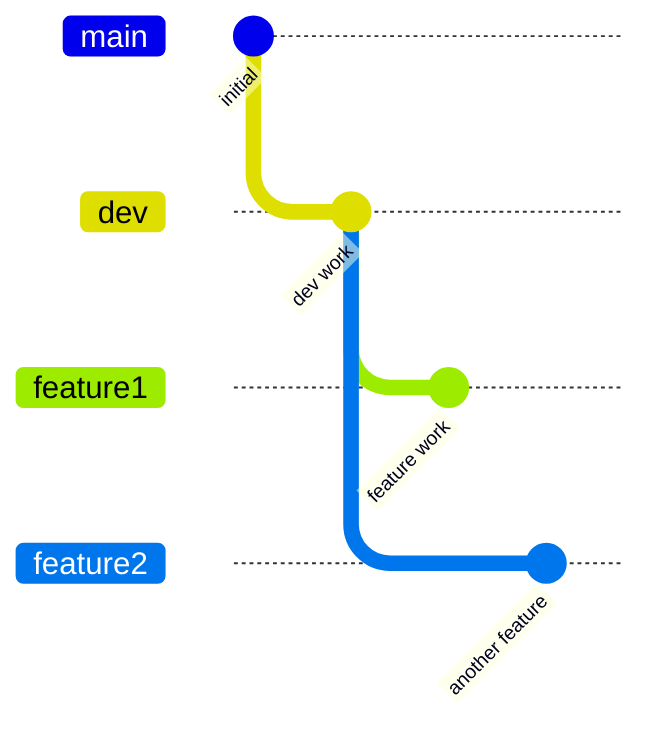
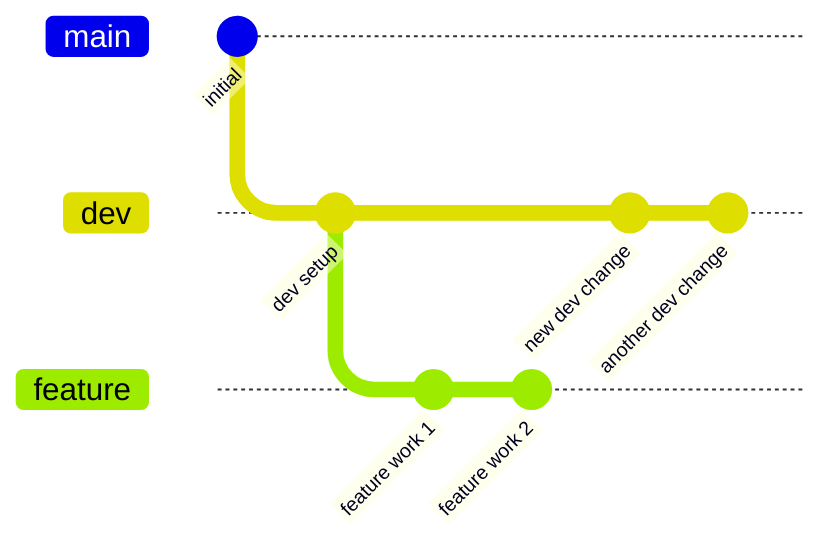
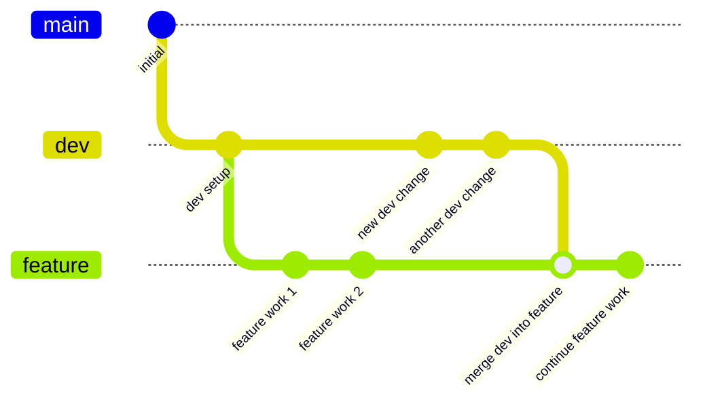
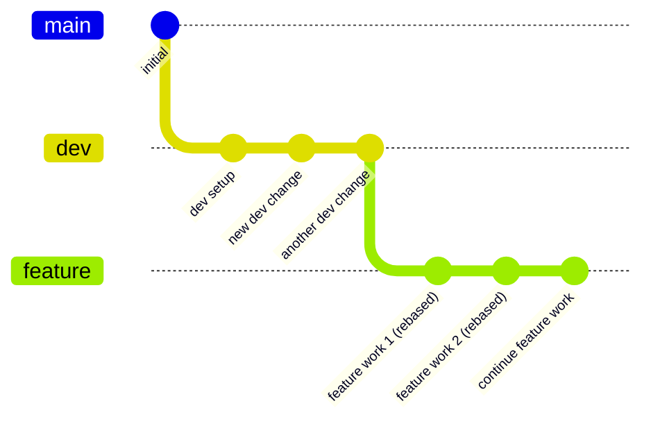
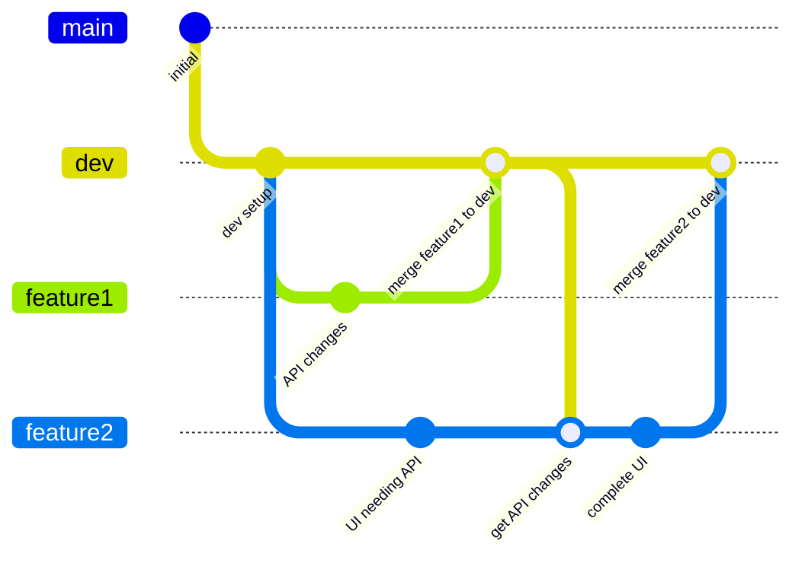
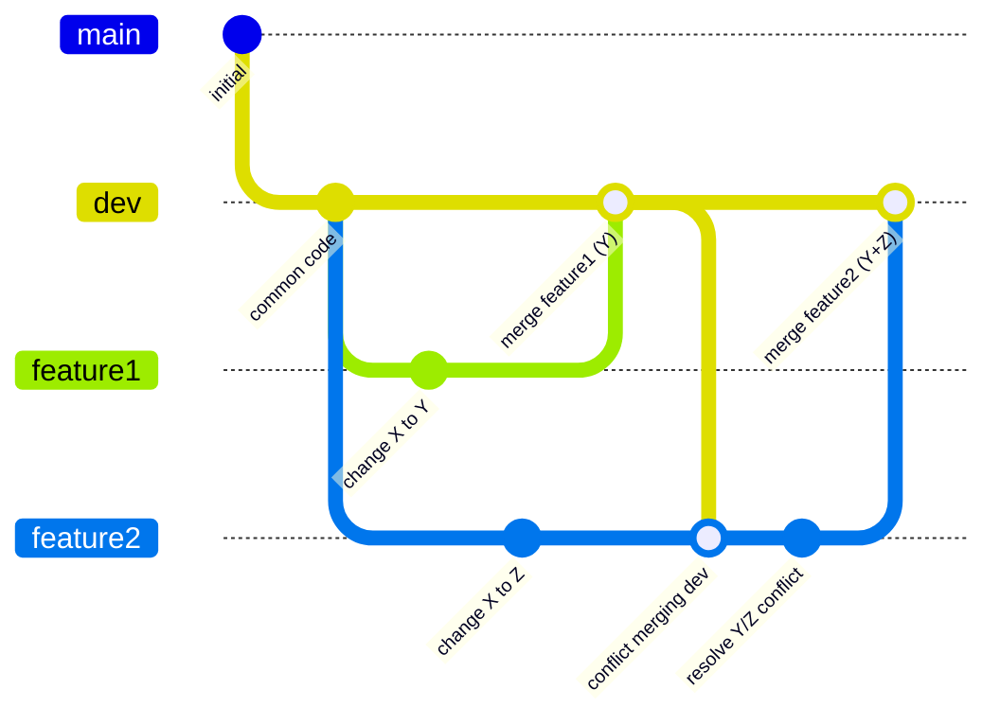

# Git Branching Strategy Guide: Master → Dev → Feature

This guide demonstrates a robust Git workflow using a Master → Dev → Feature branching strategy, with a focus on how to handle changes in the Dev branch that occur while feature branches are in progress. We'll cover both merge and rebase approaches with concrete examples.

## Table of Contents

1. [Introduction to Branching Strategy](#introduction-to-branching-strategy)
2. [Basic Workflow](#basic-workflow)
3. [When Dev Changes: Merge vs. Rebase](#when-dev-changes-merge-vs-rebase)
4. [Handling Conflicts](#handling-conflicts)
5. [Team Collaboration Scenarios](#team-collaboration-scenarios)
6. [Best Practices](#best-practices)
7. [Interactive Examples](#interactive-examples)

## Introduction to Branching Strategy

The Master → Dev → Feature branching strategy is a popular approach for team-based development. Here's how it works:

- **Master branch**: Production-ready code, always stable
- **Dev branch**: Integration branch for features, prepared for next release
- **Feature branches**: Individual features being developed



### Why This Strategy?

1. **Stability**: Master branch always contains stable, production-ready code
2. **Integration**: Dev branch serves as an integration point before production
3. **Isolation**: Feature branches allow developers to work independently
4. **Quality**: Changes pass through multiple stages of review and testing

## Basic Workflow

Let's walk through the basic workflow with this branching strategy:

### Initial Setup

```bash
# Initialize repository
git init

# Create initial commit on master
echo "# Project Title" > README.md
git add README.md
git commit -m "Initial commit"

# Create dev branch
git checkout -b dev
echo "# Development Version" > DEVELOPMENT.md
git add DEVELOPMENT.md
git commit -m "Add development documentation"
```

### Developer 1: Working on a Feature

```bash
# Create feature branch from dev
git checkout dev
git checkout -b feature/login-system

# Make changes
echo "function login() { /* ... */ }" > login.js
git add login.js
git commit -m "feat: Add login function"

# Add more changes
echo "function validateUser() { /* ... */ }" >> login.js
git add login.js
git commit -m "feat: Add user validation"
```

### Developer 2: Working on Another Feature Simultaneously

```bash
# Create another feature branch from dev
git checkout dev
git checkout -b feature/user-profile

# Make changes
echo "function displayProfile() { /* ... */ }" > profile.js
git add profile.js
git commit -m "feat: Add profile display function"
```

### Completing a Feature

```bash
# For Developer 1
git checkout dev
git merge feature/login-system
git push origin dev

# Later, when ready for production
git checkout master
git merge dev
git tag "v1.0.0"
git push origin master --tags
```

## When Dev Changes: Merge vs. Rebase

This is where things get interesting: what happens when Dev changes while you're working on a feature?

### Scenario: Dev Branch Changes During Feature Development

Let's visualize the situation:



When the Dev branch receives new changes (perhaps from other merged features), developers working on in-progress features have two main options:

### Option 1: Merge Dev into Feature

This approach brings Dev changes into your feature branch while preserving the full history.

```bash
git checkout feature/user-profile
git merge dev
# Resolve any conflicts
git commit -m "merge: Integrate latest dev changes"
```

Diagram after merging:



**Pros of Merging:**
- Preserves complete history
- Non-destructive operation (doesn't change existing commits)
- Simple to understand and apply

**Cons of Merging:**
- Creates "merge bubbles" in history
- Can make history harder to follow with many merges
- Branch history shows multiple merge commits

### Option 2: Rebase Feature onto Dev

This approach rewrites your feature branch to appear as if you started working from the latest Dev version.

```bash
git checkout feature/user-profile
git rebase dev
# Resolve any conflicts during rebase
```

Diagram after rebasing:



**Pros of Rebasing:**
- Creates a clean, linear history
- Easier to follow the project history
- Avoids unnecessary merge commits
- Makes later merges into Dev simpler

**Cons of Rebasing:**
- Rewrites commit history (could affect collaboration if not careful)
- Can be more complex to handle conflicts
- Requires force pushing if branch is already shared

## Understanding Rebasing Challenges in Detail

Rebasing is powerful but can create complications, especially in team environments. Let's explore these challenges with concrete examples.

### How Rebasing Affects Collaboration: A Practical Example

Consider this scenario with two developers, Alex and Jordan, working on the same feature branch:

1. **Initial situation**:
   ```bash
   # Both Alex and Jordan clone the repository
   git clone repo.git
   
   # Both checkout the same feature branch
   git checkout feature/user-auth
   ```

2. **Alex makes and pushes changes**:
   ```bash
   # Alex adds code
   echo "function validateEmail() { /* ... */ }" >> auth.js
   git commit -am "Add email validation"
   git push origin feature/user-auth
   ```

3. **Jordan pulls Alex's changes and works on them**:
   ```bash
   git pull
   # Jordan adds more functionality
   echo "function validatePassword() { /* ... */ }" >> auth.js
   # But hasn't pushed yet
   git commit -am "Add password validation"
   ```

4. **Alex notices Dev has changed and decides to rebase**:
   ```bash
   git checkout dev
   git pull origin dev  # Get latest dev changes
   git checkout feature/user-auth
   git rebase dev  # Rebase feature onto latest dev
   git push --force origin feature/user-auth  # Force push rebased branch
   ```

5. **What happens to Jordan now**:
   When Jordan tries to push their changes:
   ```bash
   git push origin feature/user-auth
   # ERROR: failed to push some refs...updates were rejected
   ```
   
   Or if Jordan tries to pull:
   ```bash
   git pull
   # CONFLICT: Jordan's work is now based on Alex's pre-rebased commits
   # which no longer exist in the remote branch's history
   ```

In this example, Jordan's workflow is completely broken because:
1. The commits that Jordan's work is based on no longer exist in the remote history after Alex's rebase
2. Jordan cannot simply pull or push anymore 
3. Jordan will need to perform special steps to recover

### Why Force Pushing is Required After Rebasing a Shared Branch

When you rebase a branch, you're creating completely new commits with different identifiers (SHA hashes). Here's what happens in detail:

**Before rebase**:
```
A---B---C  (dev)
     \
      D---E  (feature/payment)
```

**After rebase**:
```
A---B---C  (dev)
         \
          D'---E'  (feature/payment)
```

Notice that `D` and `E` are replaced by `D'` and `E'`. These are new commits with the same changes but different commit IDs.

If you try a normal push:
```bash
git push origin feature/payment
```

Git will reject it with something like:
```
! [rejected]        feature/payment -> feature/payment (non-fast-forward)
error: failed to push some refs...
hint: Updates were rejected because the tip of your current branch is behind
hint: its remote counterpart.
```

This is Git's way of protecting you from accidentally overwriting history.

### Dealing with Force Push Necessities

When you must force push after rebasing a shared branch:

```bash
# The safer version - checks if someone else has pushed changes
git push --force-with-lease origin feature/payment

# The absolute force push (avoid if possible)
git push --force origin feature/payment
```

**What happens when you force push**:
- The remote branch is completely replaced with your local version
- Any commits that existed only in the remote are effectively deleted
- Anyone who had the old version will now have an incompatible history

### Recovery Steps for Other Team Members After a Force Push

If someone force pushed a branch you're working on, here's what you need to do:

```bash
# 1. Stash any uncommitted changes
git stash

# 2. Fetch the latest remote changes
git fetch

# 3. Reset your local branch to match the remote
git reset --hard origin/feature/payment

# 4. Apply your stashed changes back
git stash pop
```

If you had commits that weren't pushed yet, you'll need to reapply them:

```bash
# Identify your commits that weren't pushed
git log origin/feature/payment..feature/payment

# Option 1: Use cherry-pick to reapply your commits
git reset --hard origin/feature/payment
git cherry-pick <your-commit-hash>

# Option 2: If you have many commits, create a temporary branch and rebase
git branch my-temp-work
git reset --hard origin/feature/payment
git rebase my-temp-work
```

### Alternatives to Rebasing Shared Branches

Instead of rebasing a shared branch (which requires force pushing), consider these alternatives:

1. **Use the merge approach** as described in the [Merge Workflow section](../examples/merge-workflow). Merging is safer for collaboration because it preserves all commit history.

   ```bash
   git checkout feature/payment
   git merge dev
   # Resolve any conflicts
   git commit -m "merge: Integrate latest dev changes"
   git push origin feature/payment  # No force push needed
   ```

2. **Create a new branch** from your rebased feature branch:

   ```bash
   # After rebasing your local feature branch
   git checkout -b feature/payment-rebased
   git push origin feature/payment-rebased
   
   # Create a PR from the new branch instead
   ```

3. **Coordinate the rebase** with your team:

   ```bash
   # 1. Notify team to push all their changes and stop working on the branch
   # 2. Perform the rebase and force push
   # 3. Have team members reset their branches as shown above
   ```

### When Rebasing is Appropriate

Rebase is most appropriate in these scenarios:

1. **Personal branches** that only you are working on
2. **Before sharing a branch** with the team for the first time
3. **When following team agreements** about rebasing and everyone knows the recovery process
4. **For cleaning up history** before merging to dev (if team agrees)

Remember: The main goal is clear communication and a predictable workflow. Either merge or rebase can work well with the right team protocols in place.

## Handling Conflicts

Conflicts can occur with both merge and rebase approaches when the same part of a file is changed differently.

### Resolving Conflicts During Merge

```bash
git checkout feature/login-system
git merge dev
# If conflicts occur:
# Edit files to resolve conflicts
git add <resolved-files>
git commit -m "merge: Resolve conflicts with dev"
```

### Resolving Conflicts During Rebase

```bash
git checkout feature/user-profile
git rebase dev
# If conflicts occur during rebase:
# Edit files to resolve conflicts
git add <resolved-files>
git rebase --continue
# Repeat for each commit in your branch that conflicts
```

## Team Collaboration Scenarios

Let's walk through realistic scenarios with two developers.

### Scenario 1: Feature Dependencies

Developer 1 and Developer 2 are working on related features. Developer 2 needs changes from Developer 1's feature.



### Scenario 2: Conflicting Changes

Developer 1 and Developer 2 both modify the same file in their respective feature branches.



## Best Practices

1. **Keep Dev Updated with Master**
   - Regularly merge master into dev to ensure security patches and critical fixes

2. **Feature Branch Lifetimes**
   - Keep feature branches short-lived (days, not weeks)
   - Break large features into smaller, mergeable chunks

3. **Rebase vs. Merge Decision**
   - Use rebase for personal feature branches and cleaner history
   - Use merge for shared feature branches where history preservation is important

4. **Commit Guidelines**
   - Write clear, concise commit messages
   - Make atomic commits (one logical change per commit)
   - Follow conventional commit format: `type(scope): description`

5. **Pull Request Workflow**
   - Create a pull request from feature to dev
   - Ensure CI tests pass
   - Get code review
   - Rebase or merge dev into feature before completion if dev has changed
   - Update documentation if needed

6. **Conflict Prevention**
   - Communicate with team about significant architectural changes
   - Regularly pull changes from dev to feature branches
   - Divide work to minimize overlap on the same files

## Interactive Examples

For hands-on examples, explore the `/examples` directory in this repository:

- **Basic Workflow**: Simple example of the complete flow
- **Merge Workflow**: Detailed example of the merge strategy
- **Rebase Workflow**: Detailed example of the rebase strategy

Each example includes shell scripts that can be run to simulate the workflow.

To see these workflows in action, check the script demonstrations in the `/scripts` directory, which simulate two developers working together through various scenarios.

---

The diagrams in this guide were created using Mermaid. To learn more about Mermaid syntax for Git graphs, visit [Mermaid's Git Graph documentation](https://mermaid-js.github.io/mermaid/#/gitgraph). 