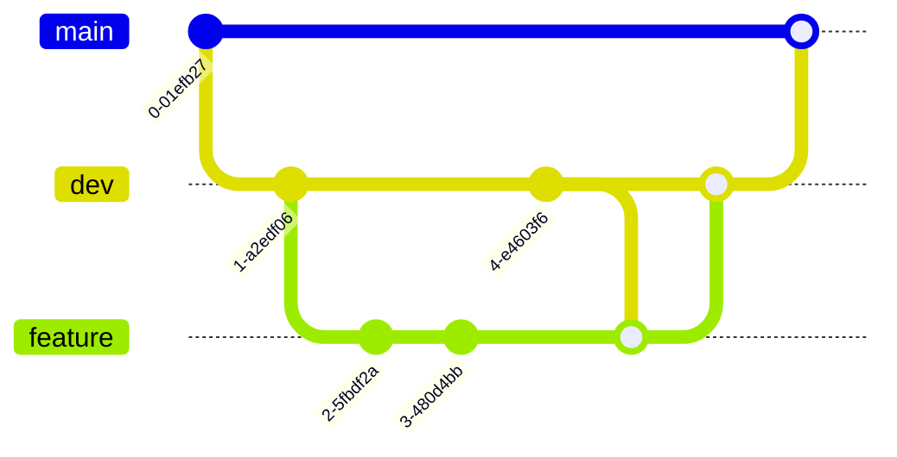

# Git Workflow Example Project Plan

## Project Overview

This project aims to demonstrate a comprehensive Git workflow using the branching strategy:
**Master → Dev → Feature**

We'll focus specifically on scenarios where the Dev branch changes while Feature branches are being worked on, highlighting best practices for collaboration between multiple developers using merge and rebase strategies.

## Project Components

1. **Documentation Files**
   - `project-plan.md` (this file) - Overview and plan for the project
   - `worklog.md` - Record of tasks completed and in progress
   - `.project-rules.md` - Rules for working with this repository

2. **Tutorial Components**
   - `git-workflow-guide.md` - Main tutorial document with explanations and diagrams
   - `/examples/` - Directory containing step-by-step examples with commands
   - `/diagrams/` - Directory for diagram source files if needed

3. **Interactive Components**
   - Shell scripts to simulate interactions between two developers
   - Sample code files to demonstrate changes across branches

## Implementation Plan

### Phase 1: Setup and Basic Documentation
1. Create initial documentation files (project-plan, worklog, project rules)
2. Set up base repository structure
3. Create diagram templates for Git workflows

### Phase 2: Basic Workflow Examples
1. Develop simple example showing the basic Master → Dev → Feature flow
2. Document standard merge workflow
3. Document standard rebase workflow
4. Create diagrams showing the difference between merge and rebase

### Phase 3: Advanced Scenarios
1. Develop example of Dev branch changing while Feature branch is in progress
2. Show conflict resolution during merge
3. Show conflict resolution during rebase
4. Document team workflow best practices

### Phase 4: Interactive Components
1. Create shell scripts to simulate multi-developer workflow
2. Develop "day in the life" scenarios showing common situations

## Approach to Diagrams

We'll use Mermaid diagrams embedded in markdown for visualizing:
1. Branch structures
2. Commit histories before and after merge/rebase
3. Developer workflows

Example of a simple Mermaid diagram in markdown:

## Interactive Demonstration Approach

To simulate multiple developers working simultaneously:
1. Create separate directories to represent each developer's workspace
2. Use shell scripts to simulate developer actions
3. Show terminal outputs at each stage
4. Provide commentary explaining what's happening and why

## Deliverables

1. Complete tutorial documentation with embedded diagrams
2. Example repository showing branch histories
3. Interactive demonstration scripts
4. Best practices and recommendations document

## Timeline

1. Setup and Basic Documentation - Day 1
2. Basic Workflow Examples - Day 2
3. Advanced Scenarios - Day 3
4. Interactive Components - Day 4
5. Review and Refinement - Day 5 